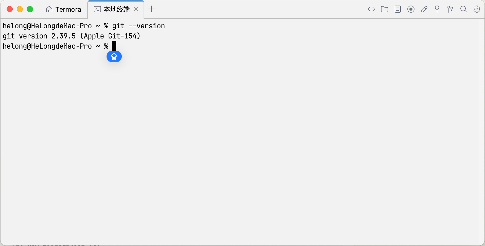
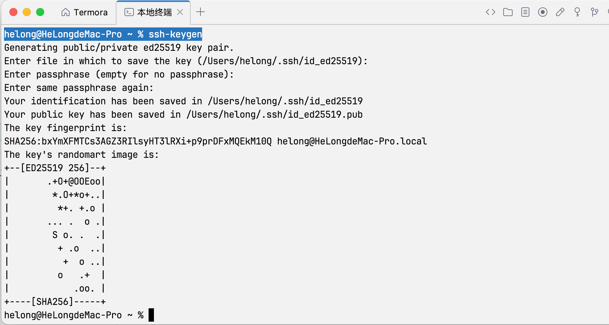
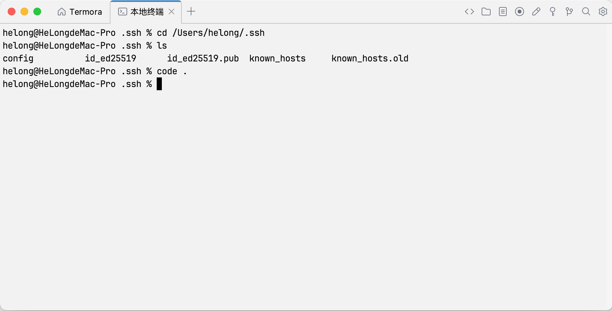
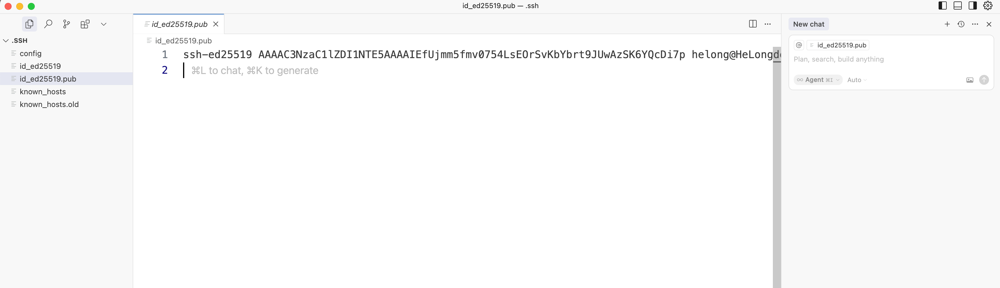
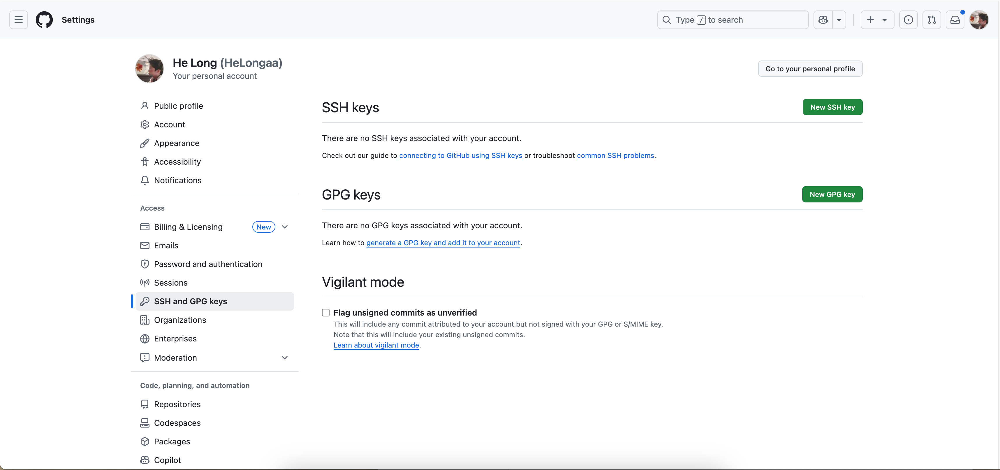
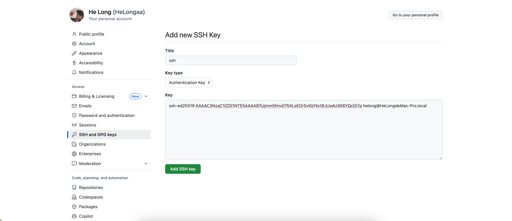
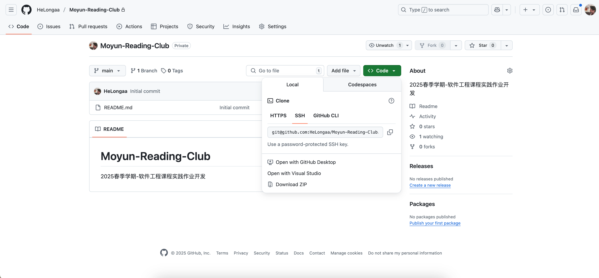
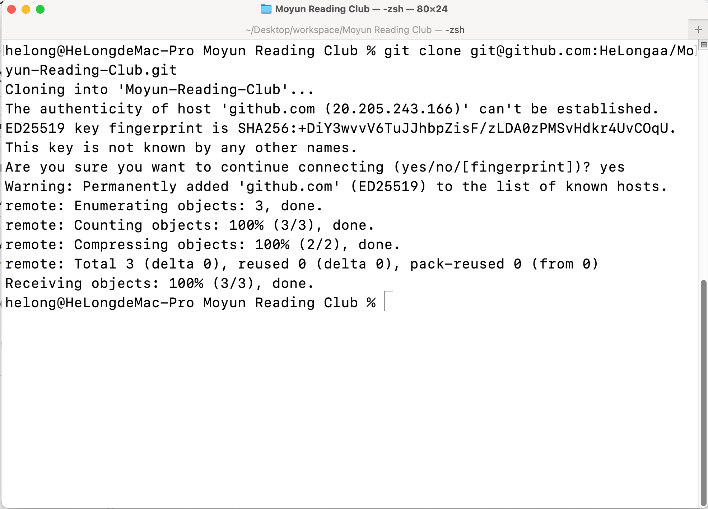
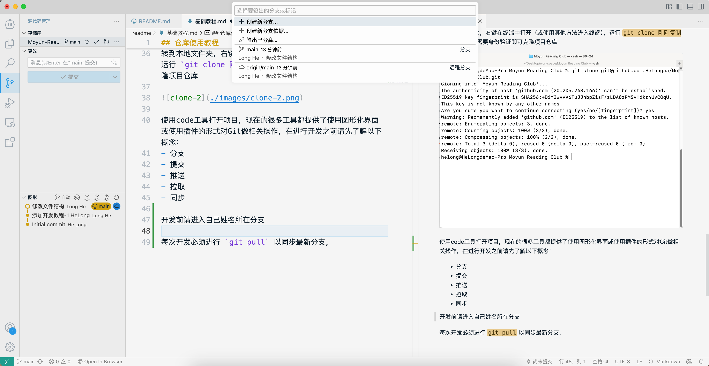

## 仓库使用教程

1. 安装[git](https://git-scm.com/)



2. 生成ssh公钥
```
helong@HeLongdeMac-Pro ~ % ssh-keygen

Windows下为：

ssh-keygen.exe
```
一路回车即可，在创建完成后，进入文件夹（终端Line 2 所选位置）


打开****.pub文件




复制所有内容到[Github/Settings/SSH And GPG Keys](https://github.com/settings/keys)
（进入后点击New SSH Key）



3. 克隆项目

进入[Github项目主页](https://github.com/HeLongaa/Moyun-Reading-Club)

点击Code--->Local--->SSH--->复制链接



转到本地文件夹，右键在终端中打开（或使用其他方法进入终端），运行 `git clone 刚刚复制的链接` 此时不需要身份验证即可克隆项目仓库



4. 开发
使用code工具打开项目，现在的很多工具都提供了使用图形化界面或使用插件的形式对Git做相关操作，在进行开发之前请先了解以下概念：
- 分支
- 提交
- 推送 
- 拉取
- 同步

开发前请创建或进入自己姓名所在分支



**每次开发必须进行 `git pull` 以同步最新分支，包括主分支和自己的分支！所有自己的分支下的代码我都会在审查结束后同步到`main`分支！！**

```
git fetch --all

git pull --all
```

提交消息规则：
提交更改时，消息请使用以下格式：
- Add:增加xx功能
- Change:修改xx
- Del:删除xx
- update:更新xx
- ...